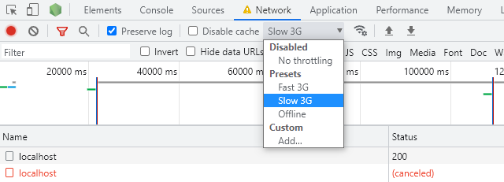
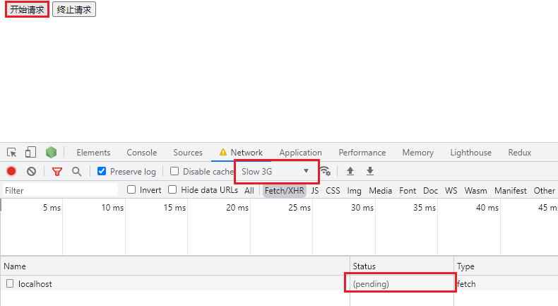
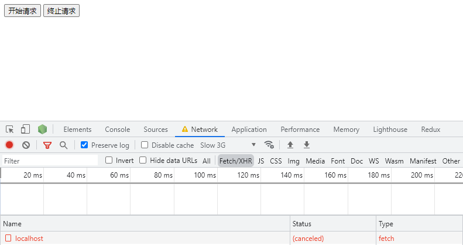

测试AbortController功能：

用于取消已经发送的请求。

这是一个实验中的功能

AbortController接口表示一个控制器对象，可以根据需要终止一个或多个Web请求。

AbortController()：AbortController()构造函数创建一个新的 AbortController 对象实例

signal：signal 属性返回一个 AbortSignal 对象实例，它可以用来 with/about 一个Web(网络)请求

abort()：终止一个尚未完成的Web(网络)请求，它能够终止 fetch 请求，任何响应Body的消费者和流

本仓库使用三种方式终止，一种用于fetch，另外两种用于axios，都是基于AbortController

使用：

服务端：

1 npm install

2 node koa.js

将服务器跑起来

客户端：

1 双击任一html，并降低网速，以模拟效果

2 点击开始请求，进入pending

3 pending期间点击终止请求，发出的请求被终止了

